# Ansible Assignment 2: High-Availability Nginx Proxy & Dynamic Website Switching

This repository contains the complete Ansible ad-hoc setup and configuration files for **Assignment 2**. The objective of this assignment is to configure an **Nginx reverse proxy** listening on port 80 that forwards traffic to an **Apache web server** running on port 8080. Additionally, it implements an automated site rotation script that toggles the live website content between two team members' sites (**Tanya** and **Heena**) using symbolic links and cron.

---

## Architecture Overview

```
                          [ Client Browser / Host ]
                                     |
                          http://team.opstree.com
                                     |
                                     v
                          +--------------------+
                          |    Nginx Proxy     |
                          |     (Port 80)      |
                          +---------+----------+
                                    |
                            proxy_pass (127.0.0.1:8080)
                                    |
                                    v
                          +--------------------+
                          | Apache Web Server  |
                          |    (Port 8080)     |
                          +---------+----------+
                                    |
                         DocumentRoot: /var/www/current
                                    |
                      +-------------+-------------+
                      |                           |
                      v                           v
              /var/www/tanya              /var/www/heena
           (hello from tanya)          (hello from heena)
```

---

## Directory & File Structure

The project files created and deployed during the assignment:

```text
Assignment-2/
├── README.md               # Assignment documentation
├── ansible.cfg             # Ansible configuration settings
├── inventory               # Inventory file containing target host definitions
├── default_proxy.conf      # Nginx reverse proxy configuration file
├── nginx-logrotate         # Custom logrotate rule limiting Nginx log size to 1GB
├── switch_site.sh          # Shell script for switching active website symlink
├── tanya.html              # HTML source file for Tanya's website
└── heena.html              # HTML source file for Heena's website
```

---

## Detailed File Descriptions

### 1. `default_proxy.conf`
Nginx server configuration acting as a reverse proxy for `team.opstree.com`.
* **Port:** Listens on port `80`.
* **Server Name:** `team.opstree.com`
* **Proxy Target:** Forwards all incoming traffic to `http://127.0.0.1:8080`.
* **Headers Passed:** Passes `Host`, `X-Real-IP`, and `X-Forwarded-For` headers to preserve client request metadata.

```nginx
server {
    listen 80;
    server_name team.opstree.com;

    location / {
        proxy_pass http://127.0.0.1:8080;
        proxy_set_header Host $host;
        proxy_set_header X-Real-IP $remote_addr;
        proxy_set_header X-Forwarded-For $proxy_add_x_forwarded_for;
    }
}
```

---

### 2. `nginx-logrotate`
Log rotation configuration enforcing a maximum size limit of **1 GB** on Nginx logs to prevent disk exhaustion.
* **Rotation Policy:** Daily rotation with a maximum retain count of 7 files.
* **Size Threshold:** Triggers rotation when logs reach `1G` (`maxsize 1G`).
* **Post-rotate:** Sends `USR1` signal to Nginx PID to reopen log files cleanly without stopping the service.

```text
/var/log/nginx/*.log {
    daily
    rotate 7
    maxsize 1G
    missingok
    notempty
    compress
    delaycompress
    sharedscripts
    postrotate
        [ -f /var/run/nginx.pid ] && kill -USR1 `cat /var/run/nginx.pid`
    endscript
}
```

---

### 3. `switch_site.sh`
Automated site rotation Bash script executed via cron.
* Calculates current Unix epoch timestamp in seconds (`MIN=$(date +%s)`).
* Computes time block using modular arithmetic (`BLOCK=$(( (MIN / 120) % 2 ))`) to toggle every 2 minutes (120 seconds).
* Switches the `/var/www/current` symbolic link atomically between `/var/www/tanya` and `/var/www/heena`.
* Reloads Apache (`systemctl reload apache2`) to reflect any changes.

```bash
#!/bin/bash
MIN=$(date +%s)
BLOCK=$(( (MIN / 120) % 2 ))

if [ $BLOCK -eq 0 ]; then
    ln -sfn /var/www/tanya /var/www/current
else
    ln -sfn /var/www/heena /var/www/current
fi

systemctl reload apache2
```

---

### 4. `tanya.html` & `heena.html`
Static HTML pages representing the content served for each team member.

**`tanya.html`**
```html
<!DOCTYPE html>
<html>
<head>
    <title>Tanya Page</title>
</head>
<body>
    <h1>hello from tanya</h1>
</body>
</html>
```

**`heena.html`**
```html
<!DOCTYPE html>
<html>
<head>
    <title>Heena Page</title>
</head>
<body>
    <h1>hello from heena</h1>
</body>
</html>
```

---

## Screenshots

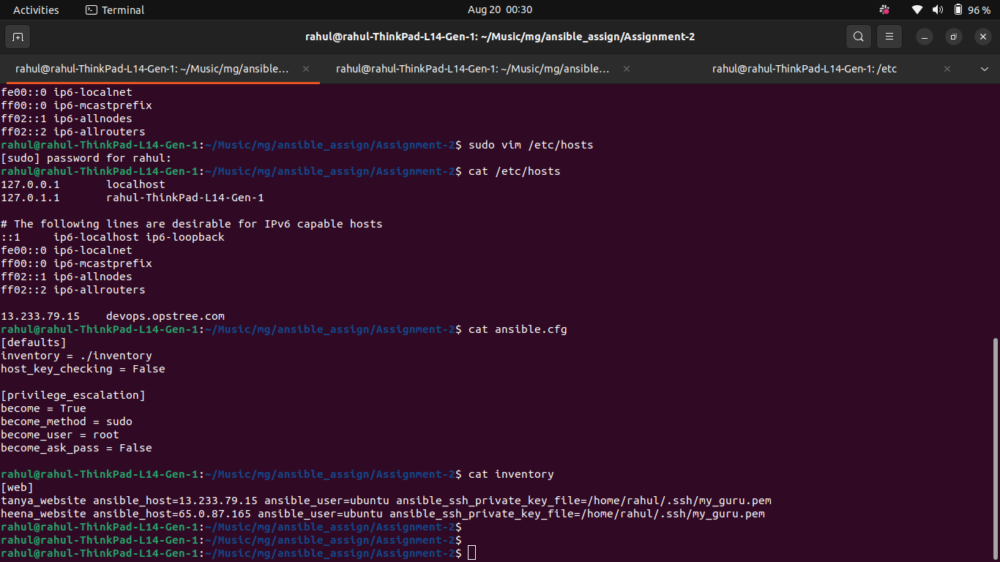
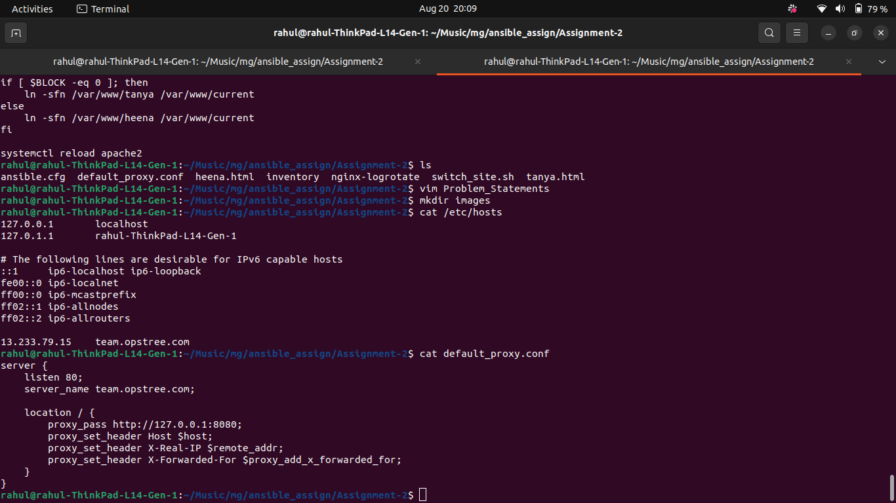
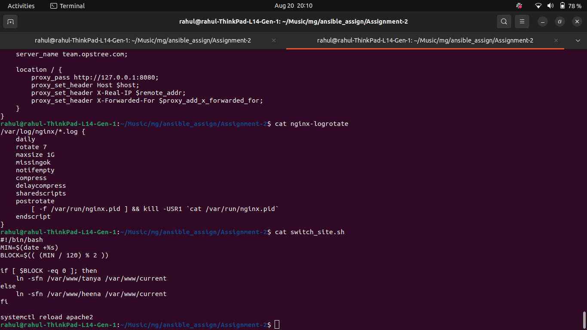
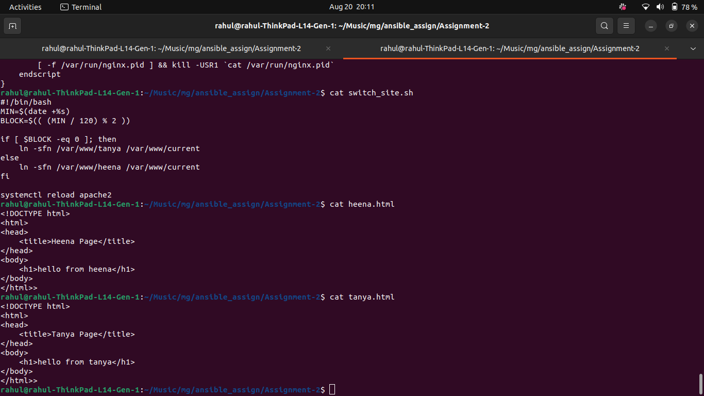


## Ansible Ad-Hoc Commands Reference

Below is the step-by-step breakdown of all Ansible ad-hoc commands used to build, configure, and troubleshoot the assignment.

### Step 1: Web Server Configuration (Apache)

1. **Reconfigure Apache Listening Port to 8080**
   ```bash
   ansible web -m lineinfile -a "path=/etc/apache2/ports.conf regexp='^Listen ' line='Listen 8080'"
   ```
   * *Purpose:* Updates `/etc/apache2/ports.conf` so Apache listens on port `8080` instead of port `80`, freeing port `80` for Nginx.

2. **Update Apache VirtualHost Header**
   ```bash
   ansible web -m lineinfile -a "path=/etc/apache2/sites-available/000-default.conf regexp='<VirtualHost' line='<VirtualHost *:8080>'"
   ```
   * *Purpose:* Changes default VirtualHost binding to `*:8080`.

3. **Update Apache DocumentRoot**
   ```bash
   ansible web -m lineinfile -a "path=/etc/apache2/sites-available/000-default.conf regexp='^\s*DocumentRoot\s+' line='	DocumentRoot /var/www/current'"
   ```
   * *Purpose:* Points Apache's DocumentRoot to the dynamic symlink `/var/www/current`.

4. **Fix Configuration Syntax Error in `apache2.conf`**
   ```bash
   ansible web -m replace -a "path=/etc/apache2/apache2.conf regexp='(?s)<Directory /var/www/>.*?</Directory>\s*Options Indexes FollowSymLinks\s*AllowOverride None\s*Require all granted\s*</Directory>' replace='<Directory /var/www/>
    Options Indexes FollowSymLinks
    AllowOverride None
    Require all granted
</Directory>'"
   ```
   * *Purpose:* Cleans up duplicate `<Directory>` block syntax errors that caused `apache2ctl configtest` failures on host nodes.

5. **Test Apache Configuration Syntax**
   ```bash
   ansible web -m command -a "apache2ctl configtest"
   ```
   * *Purpose:* Verifies that Apache configuration syntax is valid (`Syntax OK`).

6. **Restart Apache Service**
   ```bash
   ansible web -m service -a "name=apache2 state=restarted"
   ```
   * *Purpose:* Applies updated port and configuration settings to the Apache daemon.

---

## Screenshots

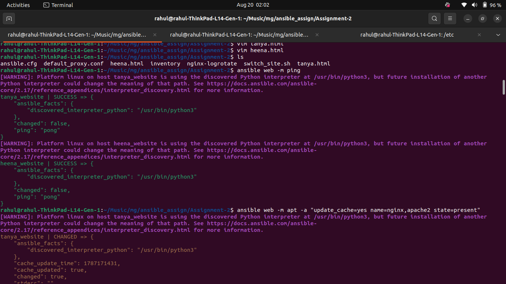
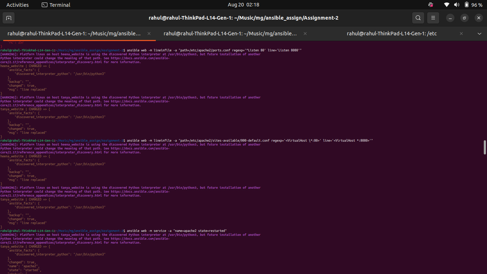
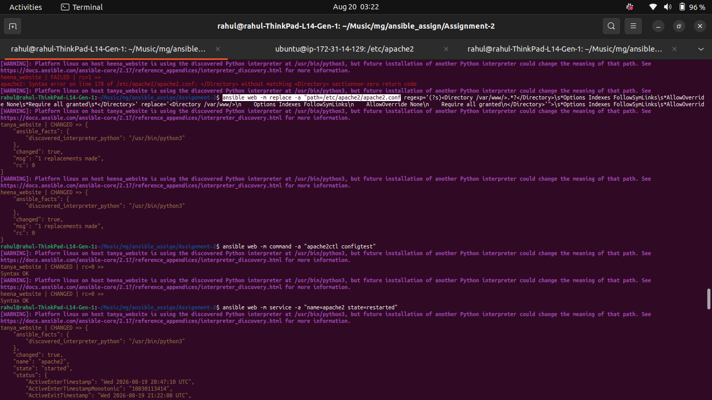
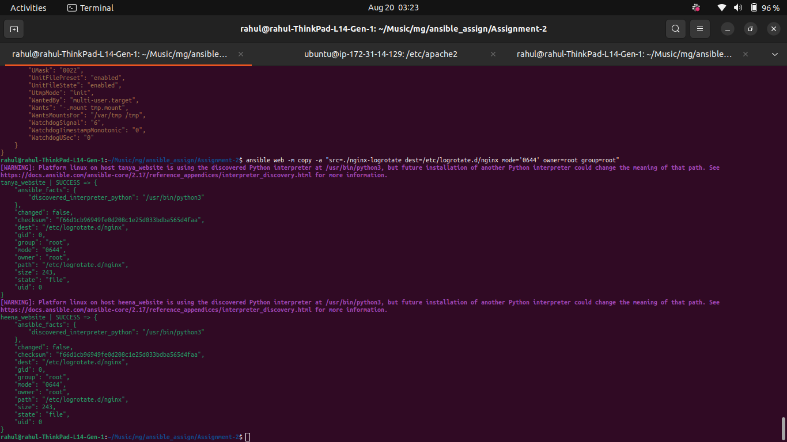


### Step 2: Website Deployment & Rotation Setup

7. **Create Website Document Directories**
   ```bash
   ansible web -m file -a "path=/var/www/tanya state=directory mode='0755'"
   ansible web -m file -a "path=/var/www/heena state=directory mode='0755'"
   ```
   * *Purpose:* Ensures document root folders for Tanya and Heena exist on remote web nodes.

8. **Deploy HTML Source Files**
   ```bash
   ansible web -m copy -a "src=./tanya.html dest=/var/www/tanya/index.html mode='0644'"
   ansible web -m copy -a "src=./heena.html dest=/var/www/heena/index.html mode='0644'"
   ```
   * *Purpose:* Copies `tanya.html` and `heena.html` from local directory to target locations.

9. **Deploy Rotation Script**
   ```bash
   ansible web -m copy -a "src=./switch_site.sh dest=/usr/local/bin/switch_site.sh mode='0755'"
   ```
   * *Purpose:* Copies the shell script to target hosts and marks it executable (`0755`).

10. **Configure Cron Job for Automated Switching**
    ```bash
    ansible web -m cron -a "name='Rotate Site Every 10 Mins' minute='*/10' job='/usr/local/bin/switch_site.sh'"
    ```
    * *Purpose:* Schedules cron execution of `switch_site.sh` every 10 minutes.

11. **Initial Manual Execution of Rotation Script**
    ```bash
    ansible web -m command -a "/usr/local/bin/switch_site.sh"
    ```
    * *Purpose:* Executes script once to generate initial `/var/www/current` symlink.

---

## Screenshots

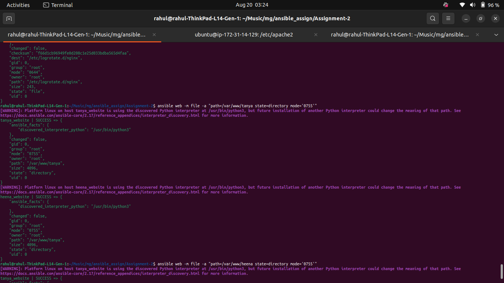
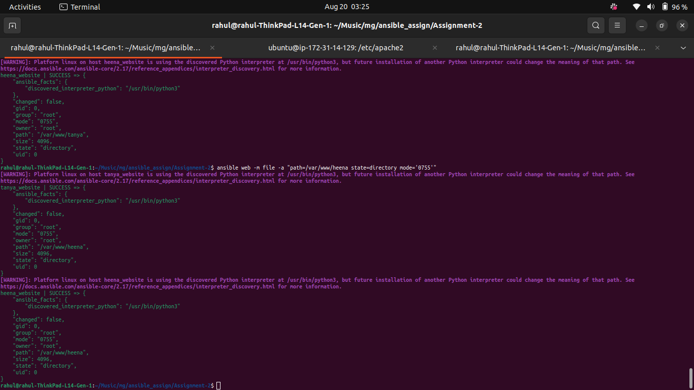
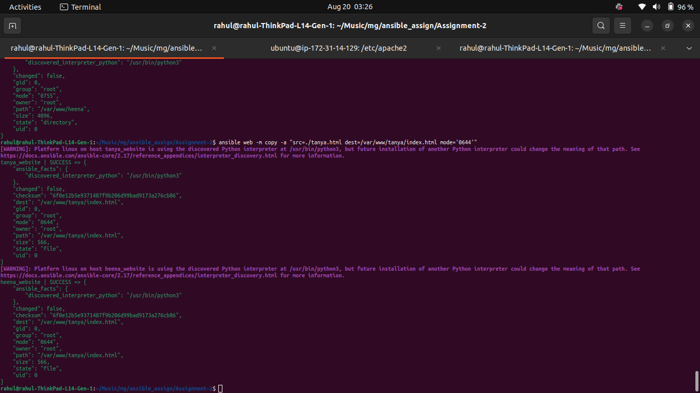
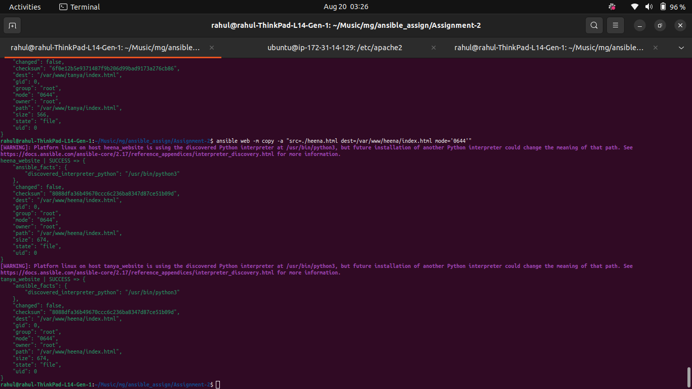
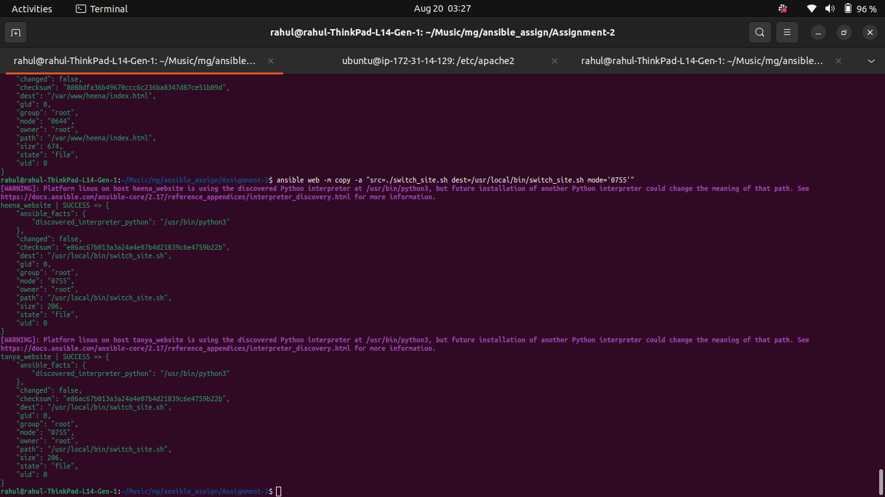
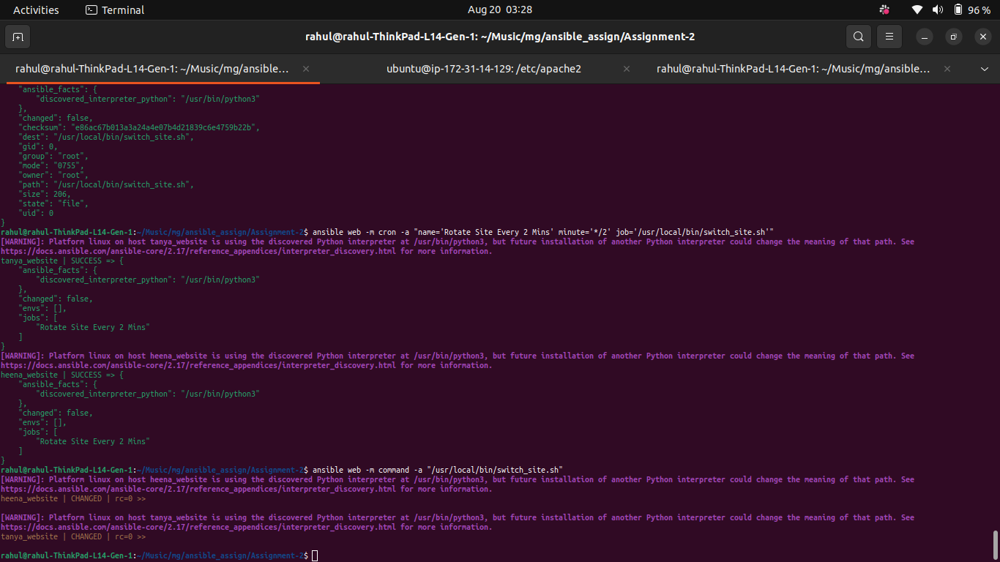


### Step 3: Nginx Proxy & Log Rotation Setup

12. **Deploy Nginx Custom Logrotate Rule**
    ```bash
    ansible web -m copy -a "src=./nginx-logrotate dest=/etc/logrotate.d/nginx mode='0644' owner=root group=root"
    ```
    * *Purpose:* Installs the 1GB log size limitation rule into `/etc/logrotate.d/nginx`.

13. **Deploy Nginx Proxy Site Configuration**
    ```bash
    ansible web -m copy -a "src=./default_proxy.conf dest=/etc/nginx/sites-available/team.conf mode='0644'"
    ```
    * *Purpose:* Uploads `default_proxy.conf` as `team.conf` on target nodes.

14. **Enable Team Site Configuration in Nginx**
    ```bash
    ansible web -m file -a "src=/etc/nginx/sites-available/team.conf dest=/etc/nginx/sites-enabled/team.conf state=link"
    ```
    * *Purpose:* Creates a symbolic link in `sites-enabled` to activate the site.

15. **Remove Default Nginx Site**
    ```bash
    ansible web -m file -a "path=/etc/nginx/sites-enabled/default state=absent"
    ```
    * *Purpose:* Disables default Nginx site configuration to avoid port 80 conflicts.

16. **Reload Nginx Daemon**
    ```bash
    ansible web -m service -a "name=nginx state=reloaded"
    ```
    * *Purpose:* Reloads Nginx configuration safely.

---

## Screenshots

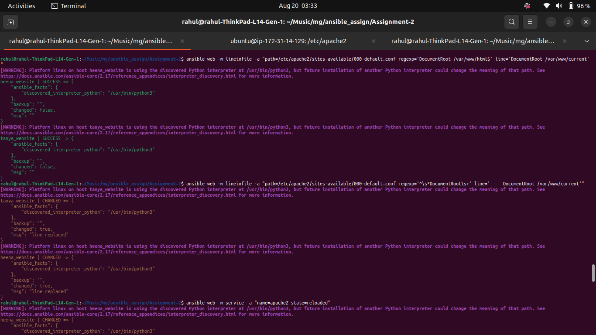
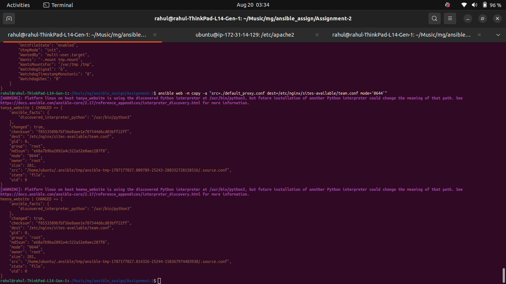
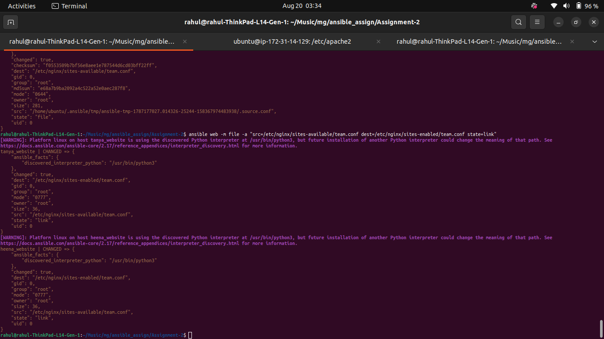
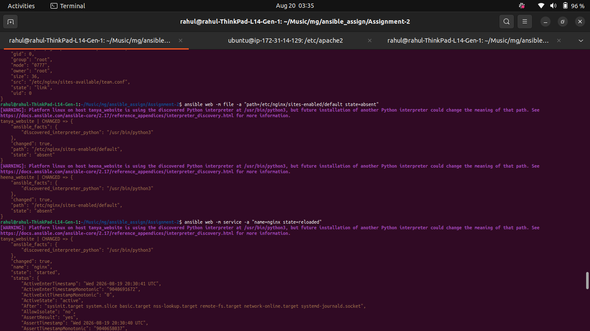


## Local Verification & Testing

### 1. Local `/etc/hosts` Configuration
To test domain mapping locally without public DNS propagation:
```text
13.233.79.15  team.opstree.com
```

### 2. Terminal Test Command
```bash
curl http://team.opstree.com
```

### 3. Browser Verification
Navigate to `http://team.opstree.com` in any browser. On refreshing every 2 minutes (or 10 minutes, depending on script timing), the response toggles between:
* `<h1>hello from tanya</h1>`
* `<h1>hello from heena</h1>`

## Screenshots


